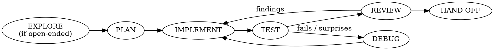

# z-build

## Overview

A streamlined **explore → plan → implement → test → review** loop. It keeps the disciplines an LLM skips on its own and drops everything else. It's meant to do everything gsd and superpowers do for a coding task — minus their subagent pipelines and on-disk artifact sprawl.

**Core principle: keep the gates, drop the scaffolding.** Heavy workflows replace your judgment with subagent pipelines and on-disk artifacts. You don't need them — you reason the plan through directly, hold the task in context, and track state in the todo list. The only things that need enforcing are the disciplines: explore before committing, align before coding, prove it works, get fresh eyes, and leave the commit to the user.

**State is ephemeral** — the todo list and this conversation. No `PLAN.md`, `RESEARCH.md`, `CONTEXT.md`, or `.planning/` files. **The skill never stages or commits** (see Hand Off).

## When to Use

- "Build / implement / add X", "fix this bug", "let's build this"
- Any multi-step code change where jumping straight to code risks building the wrong thing
- You want the structure of a real dev loop without the token cost of gsd / superpowers

**When NOT to use:** a truly trivial change (one-line fix, typo, rename) — just do it, no loop. And if the user explicitly wants the heavy multi-agent workflow, use that instead.

**Once invoked, run the whole loop** unless the user stops you. Don't peel off after planning.

## The Loop

Two beats are **conditional** — invoke them only when the task calls for it: EXPLORE (open-ended/design work) and DEBUG (something breaks). The rest always run.

### 0. EXPLORE — *only when open-ended*
For net-new, ambiguous, or design/UX-shaped work where the approach isn't obvious, **invoke `z-explore`** to surface 2–3 directions and agree on one. This is where the **visual companion** lives (live browser mockups/comparisons). Skip entirely when the approach is already clear.

### 1. PLAN
**REQUIRED SUB-SKILL:** invoke `z-plan`.

Think hard about the approach, reuse what already exists, and produce a short approach statement + a todo list. **Gate:** for non-trivial work, confirm the approach with the user before writing code. Skip the gate only when the task is small and unambiguous.

### 2. IMPLEMENT
Work the todos one at a time, keeping the list current. Reuse existing patterns and utilities — match the surrounding code. **No staging, no commits.**

For behavior that's risky or easy to get subtly wrong, and for **every bug fix**, use **`z-tdd`** — write the test and watch it fail first. For trivial/obvious code, skip the ceremony but still verify (the TEST iron law always holds).

### 3. TEST
Run the tests / the app and **show the real output.**

**Iron law: no "done" without fresh verification evidence.** Never say it works, passes, or is fixed based on "should." Run the command, see the result, then claim — with the output as proof.

If something fails or behaves unexpectedly, **invoke `z-debug`** (systematic hypothesis → test → root-cause fix) rather than guessing, then return here.

### 4. REVIEW
**REQUIRED SUB-SKILL:** invoke `z-review` (mandatory — every loop ends here).

It dispatches one fresh-context subagent over the diff, then you triage findings with rigor: verify each against the code, fix the real ones one at a time, push back on the wrong ones with evidence. After fixes, re-run TEST.

## Teaching companion — combine with `z-learn`

When the user signals they want to learn while the work happens — "teach me as we build", "walk me through this", "why this over that?", "slow down and teach" — combine this workflow with `z-learn` if available. Wait for that cue; don't offer teaching at every beat.

- `z-build` owns the **workflow**: explore, plan, implement, test, review, hand off.
- `z-learn` owns the **collaboration style**: calibration, pacing, explanation, and pausing for the user at meaningful decisions.
- **Scope teaching to what was asked.** "Teach me as we build" → apply it throughout the loop; "explain this part" → apply it only to that portion.
- **One decision, one pause** — use z-build's existing gates (the plan gate, a real fork, a review finding) as the teaching moments; don't add duplicate interruptions.
- Teaching never weakens z-build's **verification, review, or never-commit** rules — it changes how the work is *experienced*, not whether the gates hold.

## Hand Off (never commit)

When review is clean and verification passes, **stop with the changes in the working tree.** Summarize what changed, the verification evidence, and any remaining limitations.

If the user wants help preparing commits, invoke `z-commit` when available. Otherwise briefly suggest logical commit groupings when useful. **Never stage, commit, or push** — the user reviews and commits.

## Scaling

The loop flexes to the task. A small change collapses beats — a one-line approach note, the edit, one test run, a quick review. A large feature gets a real plan gate and a thorough review. Don't perform ceremony a task doesn't need; don't skip the gates a task does.

## Common Mistakes

- **Coding an ambiguous task without exploring** — if the direction isn't obvious or it's design-shaped, run EXPLORE first; a wrong direction is cheapest to fix before it's built.
- **Skipping the plan gate on non-trivial work** — the whole point is to catch a wrong approach before you've written it. Confirm first.
- **Guessing at a failure instead of debugging** — when TEST fails, invoke `z-debug` and find the root cause; don't shotgun edits.
- **Claiming success without running anything** — "should pass now" is not evidence. Run it, show output.
- **Skipping REVIEW because the change feels small** — review is mandatory; scale its depth, don't drop it.
- **Recreating the scaffolding** — writing a `PLAN.md` or `.planning/` file defeats the purpose. The todo list and conversation are the plan.
- **Committing or staging** — never. Hand off a clean working tree and let the user commit.
- **Performing every beat on a trivial fix** — EXPLORE and DEBUG are conditional; a one-liner just gets done.
- **Offering to teach every beat** — teaching is trigger-driven; wait for a learning cue, otherwise stay at normal pace.
- **Letting teaching mode soften the gates** — `z-learn` changes pace and narration, never the tests/REVIEW/never-commit disciplines.
