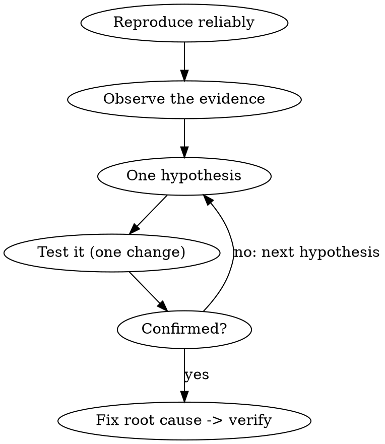

# z-debug

## Overview

Find the bug by evidence, not by guessing. Observe what's actually happening, form one falsifiable hypothesis, test it, then fix the **root cause**.

**Core principle: fix the cause, not the symptom — and change one thing at a time.** Shotgun edits and symptom-patches either hide the bug or spawn new ones. The bug is information; read it before you touch anything.

## The Loop

1. **Reproduce reliably.** Find the smallest input/steps that trigger it. If you can, capture it as a **failing test** (see `z-tdd`) — now the reproduction is automated and the fix has a gate.
2. **Observe before theorizing.** Read the *actual* error, stack trace, and output. Add logging or inspect state at the failure point. Look at what is, not what you assume.
3. **One hypothesis.** State a specific, falsifiable cause: "X is null because Y returns early when Z." Vague hunches aren't testable.
4. **Test the hypothesis with one change** — the cheapest experiment that confirms or refutes it (a log line, a value check, `git bisect`, commenting one path). One variable at a time, so the result means something.
5. **Fix the root cause, then verify** against the reproduction (green test / clean run, shown as evidence). Remove debug instrumentation. Confirm you didn't just move the symptom.

## When Stuck

Two or three failed hypotheses means stop guessing and widen the net: shrink to a minimal reproduction, `git bisect` to the commit that introduced it, check assumptions you've been treating as given, or diff against a known-good state. Re-enter the loop with new evidence — don't keep firing.

## Common Mistakes

- **Theorizing before reading the error** — look at the actual output first.
- **Changing several things at once** — you won't know which mattered. One variable per test.
- **Patching the symptom** — null-check that hides why it was null. Trace to the cause.
- **Guessing repeatedly** — after a couple of misses, get more evidence (bisect, minimal repro), don't escalate the guessing.
- **Fixing without a reproduction** — if you can't reproduce it, you can't prove you fixed it.
- **Leaving debug logs behind** — clean up the instrumentation once it's solved.
