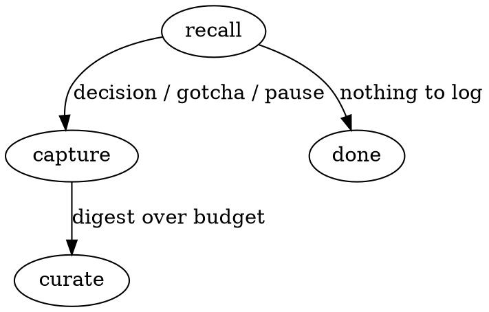

# z-log

## Overview

A lean, **in-repo episodic memory**: a curated log of *decisions, gotchas, and open threads* so the next cold session recalls the **why**, not just the what.

**Core principle: curate the why, not the what.** Record a decision when it's made, a gotcha when it bites, a thread when you pause it — not every change. Git already records what changed; this records the reasoning git can't.

Capture is **model-authored, on demand** — written when you're told to or at a wrap-up. There is deliberately **no per-tool background capture** (that noisy, heavyweight model is what this replaces). Recall is **hook-injected**: a SessionStart hook puts the digest at the top of each session.

**Two tiers, both committed:**
- `.z/log/log.md` — the **bounded digest** the hook injects: active decisions, sharp gotchas, open threads.
- `.z/log/archive.md` — append-only full history (searched on demand, never injected).
- `.z/log/meta.json` — state: `last_updated`, `last_updated_sha`, `digest_budget_lines`.

## When to Use

- A real decision is reached (chose X over Y, and the reason isn't obvious from the code)
- A gotcha / landmine surfaces ("looks wrong, is intentional — don't 'fix' it")
- You're pausing mid-thread and want the next session to pick up cleanly
- Wrapping up a work session — do a synthesis pass and propose entries
- The digest has grown — curate it
- Recall: "what did we decide about X?" → read the digest, then `.z/log/archive.md`

**When NOT to use:** routine changes, a changelog, or anything git/the PR already says. Don't log noise. Don't duplicate `z-map` — see the boundary below.

**The skill never commits.** It writes the files and hands off; the user reviews and commits.

## Boundary with `z-map`

- `z-map` = durable **structural truth** ("auth lives in `src/auth`", "tests go here").
- `z-log` = **temporal why + in-flight state** ("on 6/23 we chose X over Y because Z", "mid-refactor of the store").
- When a decision **hardens into a permanent invariant**, graduate it into `z-map`'s Conventions section (via the `z-map` skill — see `curating.md`) and archive the worklog copy (note where it went). Don't keep two copies of the same durable rule.

## The Loop



- **recall** — the hook injects the digest at session start; for deeper recall, read `.z/log/log.md` then search `.z/log/archive.md`.
- **capture** — **REQUIRED: read `capturing.md`.** Write a tight, dated entry stating the *why*; at a wrap-up, scan the session and **propose** entries (confirm before writing — don't capture noise). Update `meta.json`.
- **curate** — **REQUIRED: read `curating.md`.** Archive resolved/stale entries, close finished threads, graduate hardened invariants to `z-map`, keep the digest within budget.

## Artifact Spec

`.z/log/log.md`:
```markdown
# Worklog

<!--worklog-->
## Open threads
- <thread> — <where it stands / next step> (started <YYYY-MM-DD>)

## Decisions
- **<YYYY-MM-DD>** <decision> — because <why>; rejected <alternative>. (`<commit/PR ref>`, optional)

## Gotchas / landmines
- **<YYYY-MM-DD>** <looks-wrong-but-intentional> — don't <X>. (`file:line`, optional)
<!--/worklog-->
```
The hook injects exactly the block between the `<!--worklog-->` markers, so keep the digest within `digest_budget_lines` (default ~60). Over budget → curate, never expand.

`.z/log/meta.json`:
```json
{ "version": 1, "last_updated": "<UTC ISO 8601>", "last_updated_sha": "<git rev-parse HEAD>", "digest_budget_lines": 60 }
```
`last_updated_sha` is **HEAD at the moment you update the worklog** — a baseline the hook uses to count "commits since" as a work-happened nudge, *not* a commit that contains the worklog (the skill never commits; the user does, later). A one-commit over-count right after the user commits the worklog is expected and harmless.

## Live Controls

| User says | You do |
|-----------|--------|
| "log this" / "note this decision" | Capture one entry (`capturing.md`) into the right section; update `meta.json` |
| "wrap up" / end of work | Synthesis pass: scan the session, **propose** 0–N entries, write the confirmed ones |
| "worklog" / "what's open?" | Show the digest + freshness (last updated, commits since) |
| "what did we decide about X?" | Search the digest, then `.z/log/archive.md` |
| "curate" / "prune the worklog" | Run the curate pass (`curating.md`) |

## Common Mistakes

- **Logging the what, not the why** — "renamed foo to bar" is in git. Record the *reason* a future reader couldn't reconstruct.
- **Capturing noise** — every entry must earn its place. At wrap-up, propose and let the user cut, don't dump.
- **Letting the digest grow unbounded** — it's injected every session; curate to budget. The archive holds the long tail.
- **Duplicating `z-map`** — durable invariants graduate there; the worklog is temporal.
- **Vague entries** — date it, state the alternative rejected, point at the `file:line`/commit when useful.
- **Committing for the user** — write the files, summarize, hand off.
