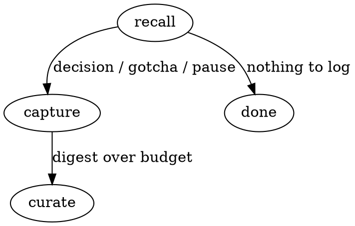

# z-log

## Overview

A lean, **in-repo episodic memory**: a curated log of _decisions, gotchas, and open threads_ so the next cold session recalls the **why**, not just the what.

**Core principle: curate the why, not the what.** Record a decision when it's made, a gotcha when it bites, a thread when you pause it — not every change. Git already records what changed; this records the reasoning git can't.

Capture is **model-authored, on demand** — written when you're told to or at a wrap-up. There is deliberately **no per-tool background capture** (that noisy, heavyweight model is what this replaces). Recall is **hook-injected**: a hook puts the digest at the top of each session, and just its Gotchas section at the top of each subagent.

**Two tiers in `.z/log/`** (commit them, or keep `.z/` local — the owner's call; the skill never commits):

- `.z/log/log.md` — the **bounded digest** the hook injects: active decisions, sharp gotchas, open threads.
- `.z/log/archive.md` — append-only history (searched on demand, never injected).
- `.z/log/meta.json` — state: `last_updated`, `digest_budget_lines`.

**The files are shared.** Parallel sessions — and every worktree, when `.z/` is symlinked in — write the same files. Change them with a targeted Edit or an append (`>>`), never by rewriting the whole file: a whole-file write (the Write tool, or read-modify-write like `open(p, "w")`, which truncates before it reads) silently drops whatever another session wrote meanwhile, or the entire file.

## When to Use

- A real decision is reached (chose X over Y, and the reason isn't obvious from the code)
- A gotcha / landmine surfaces ("looks wrong, is intentional — don't 'fix' it")
- You're pausing mid-thread and want the next session to pick up cleanly
- Wrapping up a work session — do a synthesis pass and propose entries
- The digest is flagged over budget, or threads have finished — curate it
- Recall: "what did we decide about X?" → read the digest, then `.z/log/archive.md`

**When NOT to use:** routine changes, a changelog, or anything git/the PR already says. Don't log noise.

**The skill never commits.** It writes the files and hands off; the user reviews and commits.

## What goes where

The worklog is for **temporal** knowledge. Route everything else out of it at capture time, or it piles up in the digest and the archive:

| Kind | Example | Home |
|---|---|---|
| Decision, in-flight state, temporary gotcha | "chose X over Y because Z", "mid-refactor of the store", "broken until PR 12 lands" | worklog digest |
| Durable fact about the code | "auth lives in `src/auth`", "never parallelize the report loop" | `z-map` Conventions — a small direct edit |
| Durable fact about an external system | "the upstream API silently ignores unknown fields" | `z-map` External contracts — a small direct edit |
| Inventory (tech debt, follow-ups, audit findings) | "these five helpers duplicate each other" | its own file in `.z/` (e.g. `.z/tech-debt.md`), if the repo keeps one |
| Thread detail (handoff notes, measurements, options) | the three approaches considered and their numbers | `.z/tmp/<topic>.md`, a design doc, or the PR — linked from the thread |

**The test:** will it still be true in three months with nobody acting on it? Yes → it's durable; it goes to the map now, not after a refresh. No → worklog.

## The Loop


```dot
digraph worklog {
    "recall" -> "capture" [label="decision / gotcha / pause"];
    "capture" -> "curate" [label="digest over budget"];
    "recall" -> "done"    [label="nothing to log"];
}
```

- **recall** — the hook injects the digest at session start (and warns when it's over budget); for deeper recall, read `.z/log/log.md` then search `.z/log/archive.md`.
- **capture** — **REQUIRED: read `capturing.md`.** Write a tight, dated entry stating the _why_ — or route it elsewhere per the table above; at a wrap-up, scan the session and **propose** entries (confirm before writing — don't capture noise). Update `meta.json`.
- **curate** — **REQUIRED: read `curating.md`.** The repo's maintenance pass: archive resolved/stale entries, close finished threads, graduate durable facts to `z-map`, refresh the map if it's stale, keep the digest within budget.

## Artifact Spec

`.z/log/log.md`:

```markdown
# Worklog

<!--worklog-->

## Open threads

- <thread> — <where it stands / next step>; detail: <link> (started <YYYY-MM-DD>)

## Decisions

- **<YYYY-MM-DD>** <decision> — because <why>; rejected <alternative>. (`<commit/PR ref>`, optional)

## Gotchas / landmines

- **<YYYY-MM-DD>** <looks-wrong-but-intentional> — don't <X>. (`file` → `symbol`, optional)

<!--/worklog-->
```

The hook injects exactly the block between the `<!--worklog-->` markers, so keep the digest within `digest_budget_lines` (default ~60); the hook flags it when it's over. Over budget → curate, never raise the budget. **Open threads are ≤ 2 lines each**, decisions and gotchas ≤ 3 — detail lives behind a link. Keep a Gotchas heading: subagents receive only that section.

`.z/log/meta.json`:

```json
{ "version": 1, "last_updated": "<UTC ISO 8601>", "digest_budget_lines": 60 }
```

## Live Controls

| User says                         | You do                                                                              |
| --------------------------------- | ----------------------------------------------------------------------------------- |
| "log this" / "note this decision" | Capture one entry (`capturing.md`) into the right section — or the right home; update `meta.json` |
| "wrap up" / end of work           | Synthesis pass: scan the session, **propose** 0–N entries, write the confirmed ones |
| "worklog" / "what's open?"        | Show the digest + freshness (last updated, lines vs budget)                         |
| "what did we decide about X?"     | Search the digest, then `.z/log/archive.md`                                         |
| "curate" / "prune the worklog"    | Run the curate pass (`curating.md`)                                                 |

## Common Mistakes

- **Logging the what, not the why** — "renamed foo to bar" is in git. Record the _reason_ a future reader couldn't reconstruct.
- **Capturing noise** — every entry must earn its place. At wrap-up, propose and let the user cut, don't dump.
- **Letting the digest grow** — it's injected every session; curate when the hook flags it. The archive holds the long tail.
- **Status reports as threads** — a thread is where it stands and the next step, in two lines. Measurements, options and handoff notes go behind a link.
- **Durable facts in the worklog** — they belong in the map now; waiting for a refresh is how they pile up in the digest.
- **Inventories in the worklog or archive** — lists that only grow get their own file.
- **Using the archive as a reference** — it's history. If sessions keep searching it for the same topic, that topic belongs in the map or its own file.
- **Rewriting a shared file** — Edit or append; never a whole-file write.
- **Vague entries** — date it, state the alternative rejected, point at the file and symbol or commit when useful.
- **Committing for the user** — write the files, summarize, hand off.
