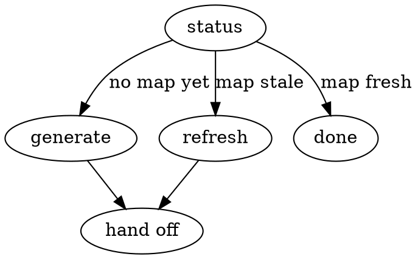

# z-map

## Overview

Maintains a **compact, in-repo, version-controlled map** of the codebase so a cold session gets oriented in seconds and jumps straight to the right `file:line` — instead of re-reading the tree every session.

**Core principle: map, not mirror.** The artifact is a high-signal index plus diagrams, never a copy of the code. It stays small enough to read cheaply every session; it points at detail, and the agent opens detail on demand. If it ever grows toward mirroring the code, it has failed.

This plays to what an LLM is already good at — reading on demand, grep/glob navigation, native Mermaid/markdown, parallel sub-agent fan-out — rather than trying to hold a whole repo in context.

**Two artifacts, committed to the repo:**
- `.z/map/map.md` — human-facing. Orientation, territory tree, Mermaid diagrams, key-files index, conventions.
- `.z/map/meta.json` — machine state: `built_against_sha`, `generated_at`, `section_index` (globs → section), thresholds.

A SessionStart hook reads these automatically and injects the Orientation block + a staleness line at the top of each session. **This skill does the heavy lifting** (build / update); the hook only reads and flags.

## When to Use

- Starting work on an unfamiliar or large repo and you want a fast cold-start
- The session-start banner says the map is stale or missing
- "Get up to speed", "onboard me", "map this codebase", "refresh the map", `codemap`
- After a big merge/refactor, to bring the map back in sync

**When NOT to use:** a trivial repo where `ls` + a glance is faster than a map; or a throwaway/scratch directory. Don't generate a map you won't maintain.

**The skill never commits.** It writes the map files and hands off; the user reviews and commits (consistent with this repo's other skills).

## The Loop

**Status first.** Check for `.z/map/meta.json`. None → `generate`. Present → compare `built_against_sha` to `git rev-parse HEAD`; behind → `refresh`; equal → report fresh, stop.

**The map tracks committed state.** Freshness is defined purely as `built_against_sha` vs `HEAD` — both the status check above and the session-start hook compare commits only. Uncommitted working-tree changes are *not* part of the freshness contract: a map can read "fresh" while the working tree has local edits, and that's intended (those edits aren't in the repo yet). `refresh` can optionally fold in working-tree changes on request (see `refreshing.md`), but doing so doesn't change what "fresh" means — only the next commit's `built_against_sha` does.

### generate (first build)
**REQUIRED: read `generating.md`** and follow it. In short: survey the top-level structure with cheap signals, fan out parallel sub-agents that return **compact summaries (never file contents)**, aggregate into the five `.z/map/map.md` sections, draw the Mermaid diagrams with `file:path`-labeled nodes, and write `.z/map/meta.json` with `built_against_sha = HEAD`. Enforce the size budget.

### refresh (incremental)
**REQUIRED: read `refreshing.md`** and follow it. In short: diff against `built_against_sha`, map changed files to sections via `section_index`, regenerate **only** the affected sections (re-fan-out only on structural change), prune deletions, and update `built_against_sha`/`generated_at`. Keep the diff on `.z/map/map.md` minimal so it reviews cleanly.

## Artifact Spec

`.z/map/map.md`, in order:
1. **Orientation** — a `## Orientation` section, its body wrapped in `<!--orientation-->` … `<!--/orientation-->` markers (the hook injects exactly that block; the heading lets `section_index` key it). What the project is, stack, entry points, how to run/test. Keep ≤ ~40 lines.
2. **Territory** — annotated directory/module tree, one line of purpose each.
3. **Diagrams** — inline Mermaid: a module-dependency graph + the 1–3 most important flows; every node labeled with a `file:path`.
4. **Key-files index** — a table of the ~20–40 files that matter most, one line each. This is the navigation jump-table.
5. **Conventions / invariants / gotchas** — where things go, patterns, "don't do X."

**Size budget:** whole file ≤ ~1500 lines. Over budget → compress (more pointers, fewer words), never expand.

## Live Controls

| User says | You do |
|-----------|--------|
| `codemap` / "is the map current?" | Run **status**: report fresh / stale (N commits, M files) / missing |
| "generate" / "map this codebase" | Follow `generating.md` to build from scratch |
| "refresh" / "update the map" | Follow `refreshing.md` to update changed sections |
| "refresh `<path>`" | Force-regenerate just that subtree's sections |
| "open `<topic>`" | Use the key-files index to jump straight to the relevant `file:line` |

## Common Mistakes

- **Mirroring instead of mapping** — pasting code or exhaustively listing every file. The map is an index of pointers; bound it.
- **Reading the whole repo into context to build it** — fan out compact summaries from sub-agents instead; the map holds `file:line` pointers, not contents.
- **Re-running a full generate on `refresh`** — refresh touches only the sections whose files changed. Full rebuild is for structural change only.
- **Letting it rot silently** — if the diff is large, refresh before relying on the map; a stale map is worse than none.
- **Committing it for the user** — write the files, summarize, hand off. The user commits.
- **Unlabeled diagram nodes** — every Mermaid node must carry a `file:path` so it's navigable, not decorative.
