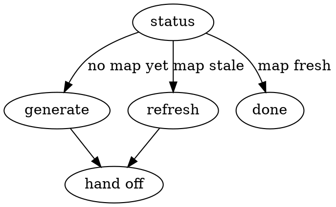

# z-map

## Overview

Maintains a **compact, in-repo map** of the codebase so a cold session gets oriented in seconds and jumps straight to the right file and symbol — instead of re-reading the tree every session.

**Core principle: map, not mirror.** The artifact is a high-signal index plus diagrams, never a copy of the code. It stays small enough to read cheaply every session; it points at detail, and the agent opens detail on demand. If it ever grows toward mirroring the code, it has failed.

This plays to what an LLM is already good at — reading on demand, grep/glob navigation, native Mermaid/markdown, parallel sub-agent fan-out — rather than trying to hold a whole repo in context.

The map records contracts, not lore. Non-obvious behavioral claims should be grounded in source pointers; important intentional behavior may also point to a representative test. Source remains authoritative if it conflicts with the map.

**Two artifacts in `.z/map/`** (commit them, or keep `.z/` local — the owner's call; the skill never commits):

- `.z/map/map.md` — human-facing. Orientation, territory tree, Mermaid diagrams, key-files index, external contracts, conventions.
- `.z/map/meta.json` — machine state: `built_against_sha`, `generated_at`, optional `base_ref`, `section_index` (globs → section), thresholds.

A hook reads these and injects the Orientation block + a staleness line at the start of every session **and every subagent** — subagents never see SessionStart context, so without it they re-explore from scratch. **This skill does the heavy lifting** (build / update); the hook only reads and flags.

**One map, many checkouts.** If `.z/` is local and the repo uses worktrees, symlink `.z/` into each worktree so every session reads and maintains the same map.

## When to Use

- Starting work on an unfamiliar or large repo and you want a fast cold-start
- The banner says the map is **STALE** (past its `stale_commits` threshold) or missing — refresh it in the next maintenance pass rather than working around it
- During a `z-log` curate pass, which checks the map as part of the same maintenance habit
- A durable fact needs recording (a convention, an external system's behavior) — a small direct edit, see below
- "Get up to speed", "onboard me", "map this codebase", "refresh the map", `codemap`

**When NOT to use:** a trivial repo where `ls` + a glance is faster than a map; or a throwaway/scratch directory. Don't generate a map you won't maintain.

**The skill never commits.** It writes the map files and hands off; the user reviews and commits (consistent with this repo's other skills).

## The Loop

```dot
digraph codemap {
    "status" -> "generate" [label="no map yet"];
    "status" -> "refresh"  [label="map stale"];
    "status" -> "done"     [label="map fresh"];
    "generate" -> "hand off";
    "refresh"  -> "hand off";
}
```

**Status first.** Check for `.z/map/meta.json`. None → `generate`. Present → resolve the base ref (below) and compare `built_against_sha` to it; behind → `refresh`; equal → report fresh, stop.

**The map tracks the default branch.** It describes merged code, so freshness is `built_against_sha` vs the **base ref**: `meta.base_ref` if set, else `origin/HEAD` (e.g. `origin/main`), else a local `main`/`master`. Not `HEAD` — worktrees and feature branches share one map but sit at different commits, so "behind HEAD" is noise there. A remote ref is only as current as the last fetch; don't fetch on your own, just say what you measured against. Unmerged and uncommitted work is never part of the map; `refresh` folds it in only on explicit request (see `refreshing.md`).

### generate (first build)

**REQUIRED: read `generating.md`** and follow it. In short: survey the top-level structure with cheap signals, fan out parallel sub-agents that return **compact summaries (never file contents)**, aggregate into the `.z/map/map.md` sections, draw the Mermaid diagrams with file-path-labeled nodes, and write `.z/map/meta.json` with `built_against_sha` = the base ref's sha. Enforce the size budget.

### refresh (incremental)

**REQUIRED: read `refreshing.md`** and follow it. In short: diff `built_against_sha..<base ref>`, map changed files to sections via `section_index`, regenerate **only** the affected sections (re-fan-out only on structural change), prune deletions, and update `built_against_sha`/`generated_at`. Keep the diff on `.z/map/map.md` minimal so it reviews cleanly.

### Small edits between refreshes

**External contracts** and **Conventions** accept small, direct edits at any time — typically a durable fact graduated from `z-log`. Keep each terse and grounded in a pointer, and leave `built_against_sha` alone (it records what the rest of the map was validated against). Everything else changes only through refresh. Don't let durable facts wait in the worklog for a refresh that may be weeks away.

## Artifact Spec

`.z/map/map.md`, in order:

1. **Orientation** — a `## Orientation` section, its body wrapped in `<!--orientation-->` … `<!--/orientation-->` markers (the hook injects exactly that block; the heading lets `section_index` key it). What the project is, stack, entry points, how to run/test. Keep ≤ ~40 lines, and don't restate what the repo's always-loaded instructions (e.g. `CLAUDE.md`) already say.
2. **Territory** — annotated directory/module tree, one line of purpose each.
3. **Diagrams** — inline Mermaid: a module-dependency graph + the 1–3 most important flows; every node labeled with a file path.
4. **Key-files index** — a table of the ~20–40 files that matter most, one line each. This is the navigation jump-table.
5. **External contracts** _(when the repo has any)_ — systems the code depends on but can't see: external services, sibling repos, vendor APIs. Where their source or docs live, how this repo reaches them, and the behaviors that bite (fields silently ignored, validation that fails open, undocumented limits). That behavior is invisible from this repo, so without this section every session rediscovers it.
6. **Conventions / invariants / gotchas** — where things go, patterns, "don't do X."

**Pointers are file + symbol, not line numbers:** `src/auth/guard.ts` → `JwtGuard.canActivate`. A line number goes stale on every edit above it; a symbol survives until it is renamed, which refresh catches. Use `:line` only when there's nothing nameable (a config block, one branch inside a long function).

**Size budget:** whole file ≤ ~1500 lines. Over budget → compress (more pointers, fewer words), never expand.

## Live Controls

| User says                         | You do                                                                 |
| --------------------------------- | ---------------------------------------------------------------------- |
| `codemap` / "is the map current?" | Run **status**: report fresh / stale (N commits, M files vs base ref) / missing |
| "generate" / "map this codebase"  | Follow `generating.md` to build from scratch                           |
| "refresh" / "update the map"      | Follow `refreshing.md` to update changed sections                      |
| "refresh `<path>`"                | Force-regenerate just that subtree's sections                          |
| "add to the map: `<fact>`"        | Small direct edit to External contracts or Conventions                 |
| "open `<topic>`"                  | Use the key-files index to jump straight to the relevant file and symbol |

## Common Mistakes

- **Mirroring instead of mapping** — pasting code or exhaustively listing every file. The map is an index of pointers; bound it.
- **Reading the whole repo into context to build it** — fan out compact summaries from sub-agents instead; the map holds pointers, not contents.
- **Re-running a full generate on `refresh`** — refresh touches only the sections whose files changed. Full rebuild is for structural change only.
- **Living with the STALE banner** — a map past its threshold gives confidently wrong answers, which is worse than none. Refresh it in the next maintenance pass (a `z-log` curate pass does this).
- **Measuring freshness against `HEAD`** — on a feature branch or worktree that number is noise; the map tracks the base ref.
- **Line-number pointers** — they rot on unrelated edits; anchor on symbols.
- **Durable facts stuck in the worklog** — a rule that is simply how the code, or an external system, works belongs in Conventions / External contracts now, as a small edit.
- **Committing it for the user** — write the files, summarize, hand off. The user commits.
- **Unlabeled diagram nodes** — every Mermaid node must carry a file path so it's navigable, not decorative.
- **Fresh SHA, stale truth** — advancing built_against_sha without revalidating map claims/pointers affected by the changed files. A map can be metadata-fresh while semantically stale; changed referenced files invalidate their mapped claims.
